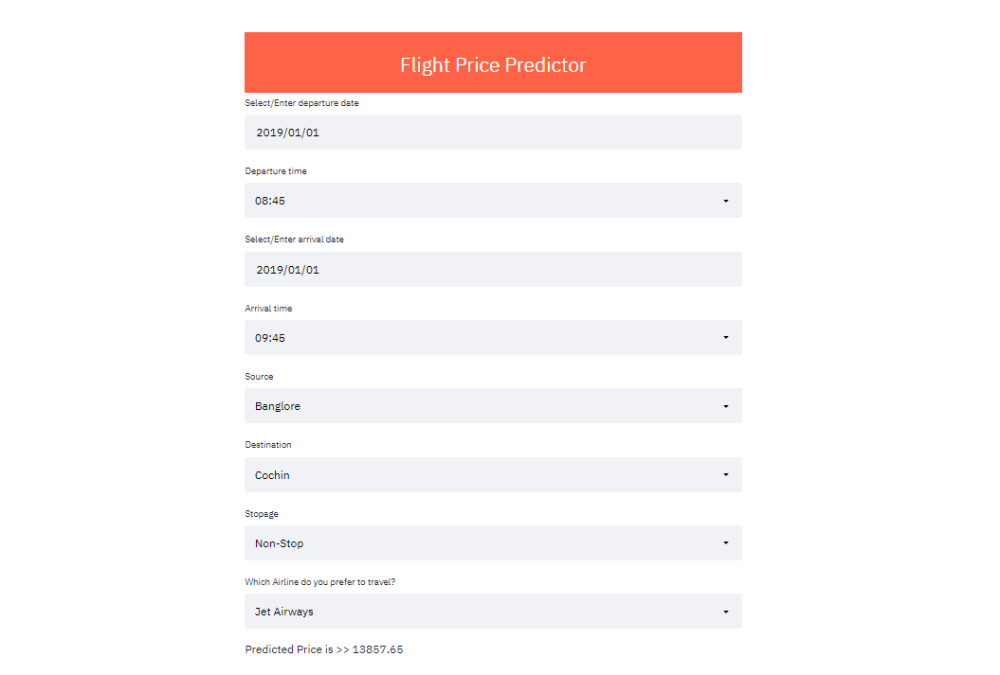

# Flight-Price-Predictor

Deployed on Heroku -- https://flight-price-predictor-tanish.herokuapp.com/

Dataset is taken from Kaggle.

### Description
- Data_Train.xlsx is the dataset file.
- xgb_flight2.pkl is the model file.
- app.py is the python code for UI of the project.
- Procfile and setup.sh is for heroku deployment.
- requirements.txt contains the libraries need to install to run the app.py code.

### To run the project locally.
1. Download the entire repo.
2. Open Anaconda Command Prompt.
3. Change directory to project repo.
4. Run command "pip install -r requirements.txt"
5. Run command "streamlit run app.py"

## App Demo-

